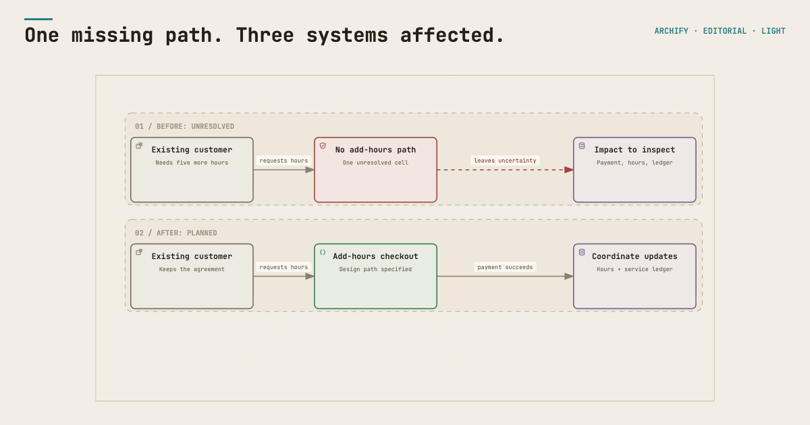
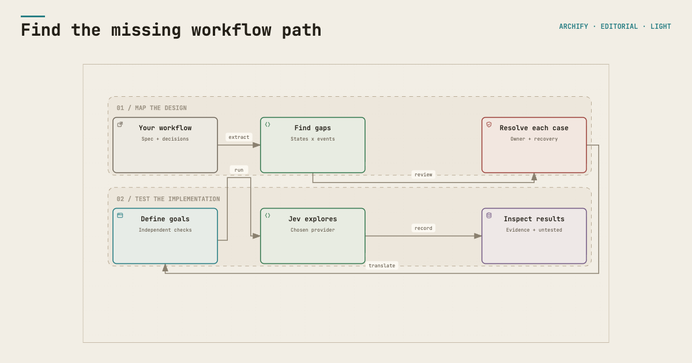

# State Gap + Jev

Find the workflow cases your design forgot. Then see what your implementation actually does.

An existing customer wants more service hours. The design handles a new contract, payment and fulfillment, but misses the add-hours path. State Gap exposes the missing decision. Jev can explore the implemented journey. Archify makes the workflow understandable.



Both Jev providers have executed the broken and corrected browser example. The results preserve the exact checks, screenshots and untested paths. See [verification](docs/verification.md) for the evidence and known limits.

| Start here | You get | You need |
| --- | --- | --- |
| [Explore the example](examples/add-hours/README.md) | Before/after model, report and interactive map | No API key; Node.js to rerun checks |
| [Map my workflow](docs/model.md) | Missing decisions, owners, recovery and a visual | Your specification and a coding agent |
| [Test my implementation](docs/journeys.md) | Observed results, evidence and untested paths | Python, Chromium and a Jev provider |

## Give this to your agent

```text
Open https://github.com/aiwriter28/state-gap-jev and read SKILL.md.
Guide me through setup using the repository, cloning it locally when needed.
Start with the example so I understand the result, then help me map my workflow.
Check what my agent environment can run and handle the reversible setup for me.
For live Jev testing, offer OpenRouter or TypeSafe directly and reuse my choice.
Explain what is planned, what was tested, and what remains unverified.
```

Your agent uses the [setup guide](docs/setup.md), asks only for missing decisions or account actions, and keeps credentials out of chat. You can use the repository directly before installing it as a skill.

## See the result

The synthetic [before report](examples/add-hours/before-report.md) has one missing cell, three unreachable payment states and a dead end. The [resolved design](examples/add-hours/after-report.md) has 48 explicitly resolved cells.

Download/open the [interactive comparison](visuals/before-after.html) and [results viewer](examples/add-hours/results.html) locally. The viewer filters statuses and shows the exact checks behind linked goal results. GitHub displays HTML source rather than running it.



A complete model is not proof of a working implementation. A browser reaching checkout does not prove that payment, entitlement, mail or recovery works. Those need independent observations and, for writes, sandbox adapters.

## Go deeper when you need it

- [OpenRouter or TypeSafe](docs/providers.md), plus the separate helper for form text.
- [Journey testing](docs/journeys.md) and [advanced sandbox contracts](docs/advanced.md).
- [Visuals and evidence](docs/visuals.md), including maps for your own workflow.
- [Maintenance](docs/maintenance.md), [verification](docs/verification.md) and [third-party notices](THIRD_PARTY_NOTICES.md).

The example is fictional. Private project adapters and credentials are not bundled. This package does not replace independent adversarial review. Its single entry point coordinates State Gap, Jev testing and Archify display.

This package shares the State Gap modeling method with the separate State Gap Mapper web application. Your agent works directly from this repository; no web-app account is required.

[Observed browser results](examples/add-hours/README.md#recorded-browser-evidence) show the exact limits of a pass. [Security review](docs/security.md) documents executable hooks, provider data flow and the reviewed scanner findings.

Licensed under [MIT](LICENSE), with [third-party notices](THIRD_PARTY_NOTICES.md).
