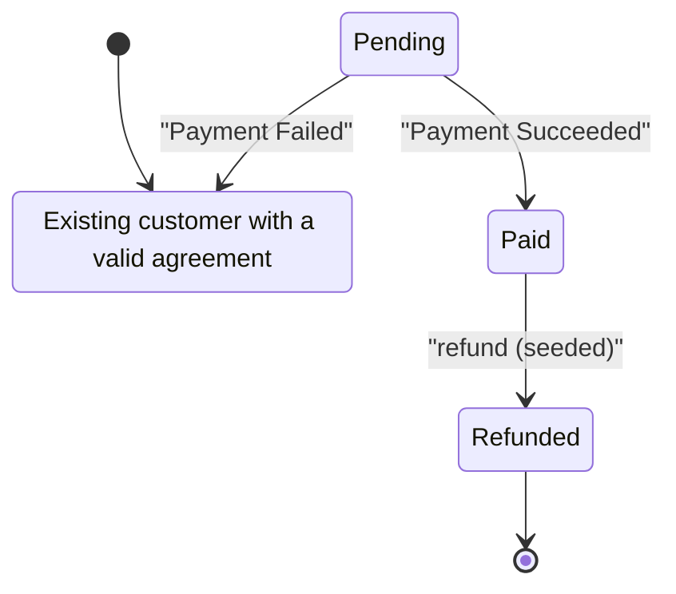
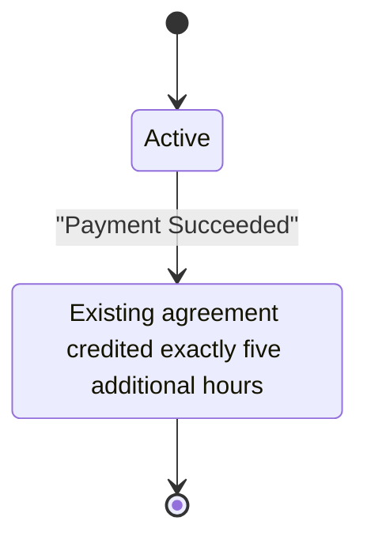
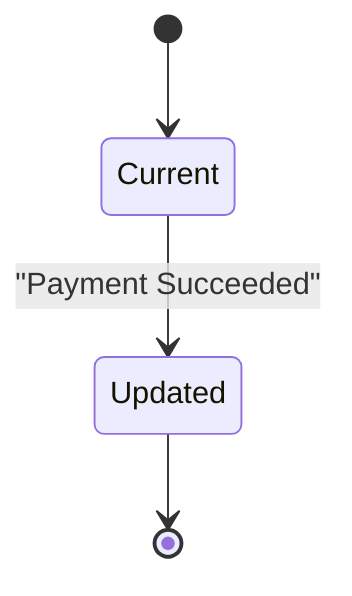

<!-- state-gap:begin -->
## Systems

| System | Resolution |
|---|---|
| payment | Region `payment` |
| entitlement | Region `entitlement` |
| operations | Region `operations` |

## Payment matrix

| State | Add Hours | Payment Succeeded | Payment Failed | refund (seeded) | duplicate_purchase (seeded) | late_or_repeated_webhook (seeded) |
|---|---|---|---|---|---|---|
| Existing customer with a valid agreement |  | A | I | I | I | I |
| Pending | I | W | W | I | I | I |
| Paid | I | I | I | W | I | I |
| Refunded | I | I | I | I | I | I |

## Payment Mermaid

## Payment transitions

- In `pending`, event `payment_succeeded` moves the region to `paid`. Evidence: spec.md
- In `pending`, event `payment_failed` moves the region to `ready`. Evidence: spec.md
- In `paid`, event `refund` (seeded) moves the region to `refunded`. Evidence: spec.md

## Entitlement matrix

| State | Add Hours | Payment Succeeded | Payment Failed | refund (seeded) | duplicate_purchase (seeded) | late_or_repeated_webhook (seeded) |
|---|---|---|---|---|---|---|
| Active | I | W | I | I | I | I |
| Existing agreement credited exactly five additional hours | I | I | I | A | I | I |

## Entitlement Mermaid

## Entitlement transitions

- In `active`, event `payment_succeeded` moves the region to `increased`. Evidence: Design: spec.md, credit exactly five additional hours to the existing agreement. Requires an independent backend assertion; not proved by the navigation demo.

## Operations matrix

| State | Add Hours | Payment Succeeded | Payment Failed | refund (seeded) | duplicate_purchase (seeded) | late_or_repeated_webhook (seeded) |
|---|---|---|---|---|---|---|
| Current | I | W | I | I | I | I |
| Updated | I | I | I | A | I | I |

## Operations Mermaid

## Operations transitions

- In `current`, event `payment_succeeded` moves the region to `updated`. Evidence: spec.md

## Gaps

- `payment` / `ready` / `add_hours`

## Ignored decisions

- `payment` / `ready` / `payment_failed`: Payment failed leaves payment in ready. No side effect is specified in this synthetic example.
- `payment` / `ready` / `refund`: Refund leaves payment in ready. No side effect is specified in this synthetic example.
- `payment` / `ready` / `duplicate_purchase`: Deduplicate using the original order and event IDs. This design decision needs backend verification.
- `payment` / `ready` / `late_or_repeated_webhook`: Deduplicate using the original order and event IDs. This design decision needs backend verification.
- `payment` / `pending` / `add_hours`: Add hours leaves payment in pending. No side effect is specified in this synthetic example.
- `payment` / `pending` / `refund`: Refund leaves payment in pending. No side effect is specified in this synthetic example.
- `payment` / `pending` / `duplicate_purchase`: Deduplicate using the original order and event IDs. This design decision needs backend verification.
- `payment` / `pending` / `late_or_repeated_webhook`: Deduplicate using the original order and event IDs. This design decision needs backend verification.
- `payment` / `paid` / `add_hours`: Add hours leaves payment in paid. No side effect is specified in this synthetic example.
- `payment` / `paid` / `payment_succeeded`: Payment succeeded leaves payment in paid. No side effect is specified in this synthetic example.
- `payment` / `paid` / `payment_failed`: Payment failed leaves payment in paid. No side effect is specified in this synthetic example.
- `payment` / `paid` / `duplicate_purchase`: Deduplicate using the original order and event IDs. This design decision needs backend verification.
- `payment` / `paid` / `late_or_repeated_webhook`: Deduplicate using the original order and event IDs. This design decision needs backend verification.
- `payment` / `refunded` / `add_hours`: Add hours leaves payment in refunded. No side effect is specified in this synthetic example.
- `payment` / `refunded` / `payment_succeeded`: Payment succeeded leaves payment in refunded. No side effect is specified in this synthetic example.
- `payment` / `refunded` / `payment_failed`: Payment failed leaves payment in refunded. No side effect is specified in this synthetic example.
- `payment` / `refunded` / `refund`: Refund leaves payment in refunded. No side effect is specified in this synthetic example.
- `payment` / `refunded` / `duplicate_purchase`: Deduplicate using the original order and event IDs. This design decision needs backend verification.
- `payment` / `refunded` / `late_or_repeated_webhook`: Deduplicate using the original order and event IDs. This design decision needs backend verification.
- `entitlement` / `active` / `add_hours`: Add hours leaves entitlement in active. No side effect is specified in this synthetic example.
- `entitlement` / `active` / `payment_failed`: Payment failed leaves entitlement in active. No side effect is specified in this synthetic example.
- `entitlement` / `active` / `refund`: Refund leaves entitlement in active. No side effect is specified in this synthetic example.
- `entitlement` / `active` / `duplicate_purchase`: Deduplicate using the original order and event IDs. This design decision needs backend verification.
- `entitlement` / `active` / `late_or_repeated_webhook`: Deduplicate using the original order and event IDs. This design decision needs backend verification.
- `entitlement` / `increased` / `add_hours`: Add hours leaves entitlement in increased. No side effect is specified in this synthetic example.
- `entitlement` / `increased` / `payment_succeeded`: Payment succeeded leaves entitlement in increased. No side effect is specified in this synthetic example.
- `entitlement` / `increased` / `payment_failed`: Payment failed leaves entitlement in increased. No side effect is specified in this synthetic example.
- `entitlement` / `increased` / `duplicate_purchase`: Deduplicate using the original order and event IDs. This design decision needs backend verification.
- `entitlement` / `increased` / `late_or_repeated_webhook`: Deduplicate using the original order and event IDs. This design decision needs backend verification.
- `operations` / `current` / `add_hours`: Add hours leaves operations in current. No side effect is specified in this synthetic example.
- `operations` / `current` / `payment_failed`: Payment failed leaves operations in current. No side effect is specified in this synthetic example.
- `operations` / `current` / `refund`: Refund leaves operations in current. No side effect is specified in this synthetic example.
- `operations` / `current` / `duplicate_purchase`: Deduplicate using the original order and event IDs. This design decision needs backend verification.
- `operations` / `current` / `late_or_repeated_webhook`: Deduplicate using the original order and event IDs. This design decision needs backend verification.
- `operations` / `updated` / `add_hours`: Add hours leaves operations in updated. No side effect is specified in this synthetic example.
- `operations` / `updated` / `payment_succeeded`: Payment succeeded leaves operations in updated. No side effect is specified in this synthetic example.
- `operations` / `updated` / `payment_failed`: Payment failed leaves operations in updated. No side effect is specified in this synthetic example.
- `operations` / `updated` / `duplicate_purchase`: Deduplicate using the original order and event IDs. This design decision needs backend verification.
- `operations` / `updated` / `late_or_repeated_webhook`: Deduplicate using the original order and event IDs. This design decision needs backend verification.

## Absent decisions

- `payment` / `ready` / `payment_succeeded`: Owner: Payment operations. Recovery: Quarantine the unmatched payment and reconcile its order before granting hours.
- `entitlement` / `increased` / `refund`: Owner: Service operations. Recovery: Review consumed hours, adjust remaining entitlement and reconcile the service ledger manually.
- `operations` / `updated` / `refund`: Owner: Service operations. Recovery: Review consumed hours, adjust remaining entitlement and reconcile the service ledger manually.

## Unreachable states

- `payment` / `pending`
- `payment` / `paid`
- `payment` / `refunded`

## Dead-end states

- `payment` / `ready`
<!-- state-gap:end -->
